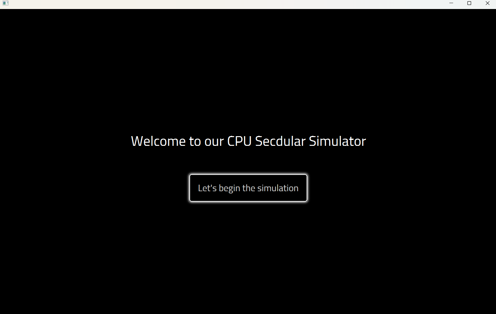
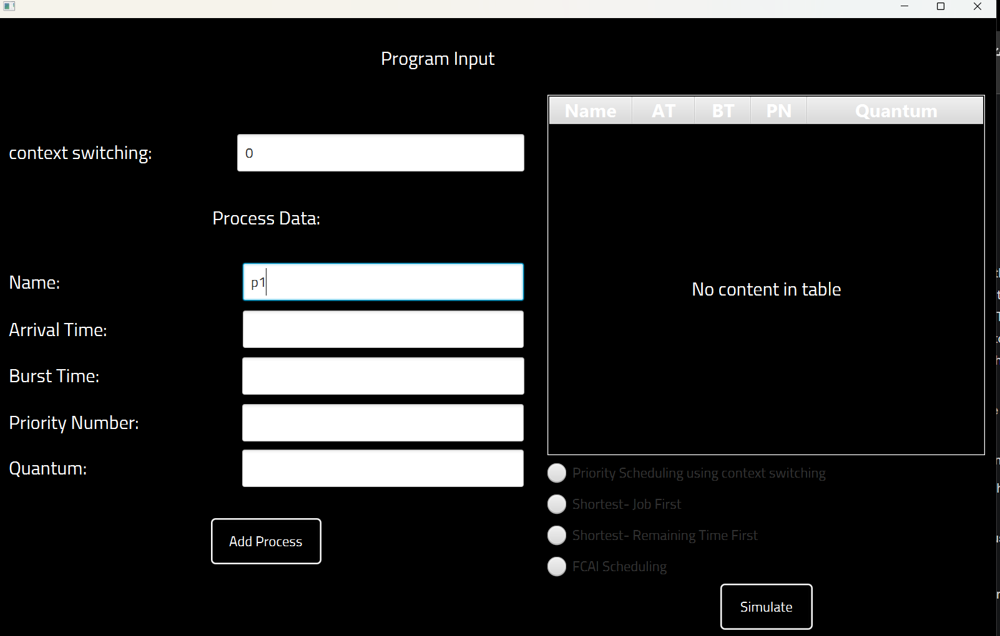
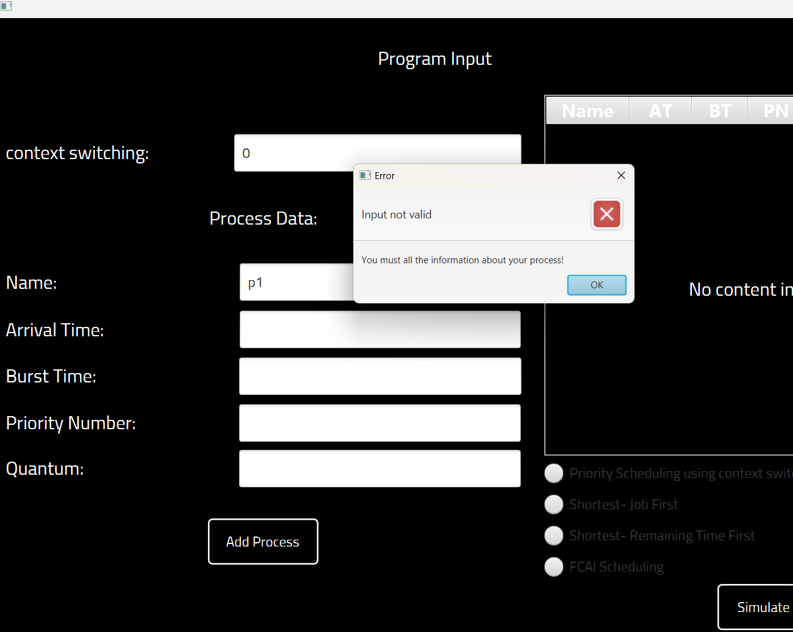
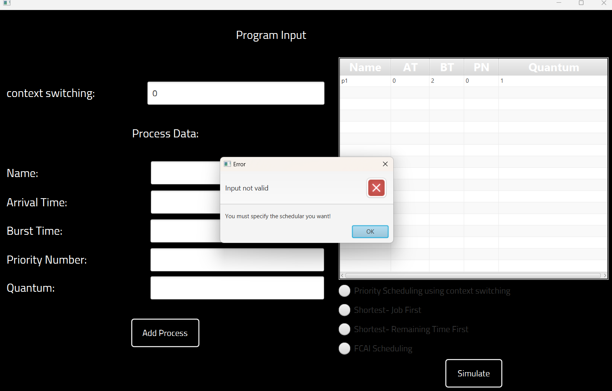
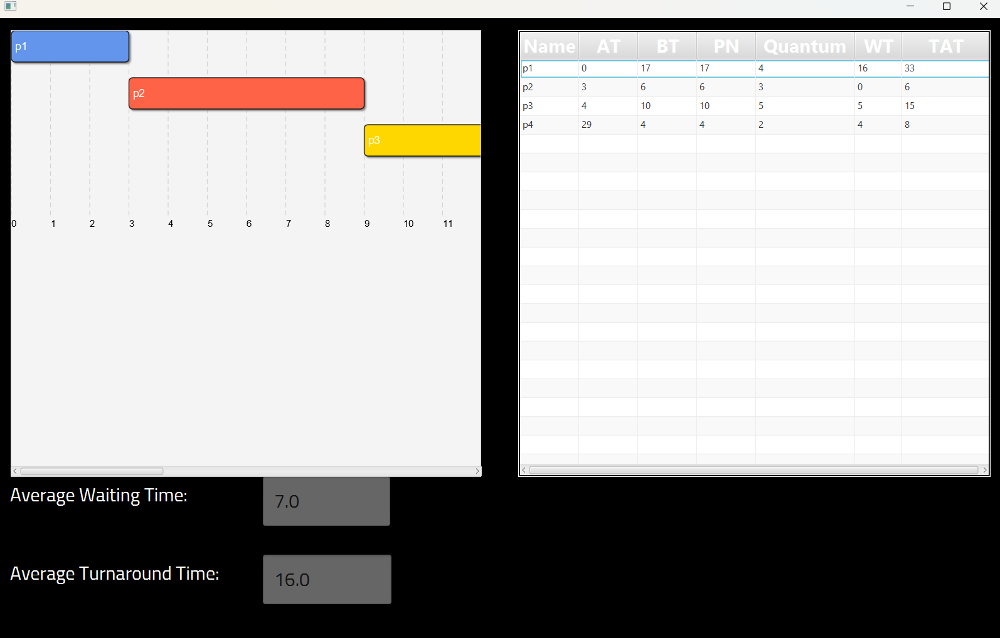

# CPU Scheduler Simulator

## Overview
The CPU Scheduler Simulator is a JavaFX-based application developed as an assignment for the Operating Systems course in the third year of the Computer Science Faculty at Cairo University, academic year 2024/2025, under the Faculty of Computers and Artificial Intelligence (FCAI). The project provides an educational tool to explore CPU scheduling algorithms by allowing users to input process details, select an algorithm, and visualize execution order and performance metrics through a graphical interface. The implemented algorithms are:

1. **Non-Preemptive Priority Scheduling**: Schedules processes based on priority (lower value = higher priority) without interruption.
2. **Non-Preemptive Shortest Job First (SJF)**: Executes the process with the shortest burst time first.
3. **Shortest Remaining Time First (SRTF)**: Preemptively schedules processes based on the shortest remaining execution time.
4. **FCAI Scheduling**: A custom adaptive algorithm that dynamically adjusts quantum values using an FCAI factor (based on priority, arrival time, and remaining time).

The simulator calculates waiting and turnaround times, displaying results in a table and a color-coded Gantt chart within a styled JavaFX GUI.

---

## Features
- **Four Scheduling Algorithms**: Implements Priority, SJF, SRTF, and FCAI Scheduler.
- **Interactive GUI**: Uses FXML for layouts, CSS for styling, and controllers for event handling.
- **Performance Metrics**: Shows per-process and average waiting and turnaround times.
- **Gantt Chart Visualization**: Displays execution order with colored blocks in a scrollable pane.
- **Dynamic Quantum Management**: FCAI Scheduler adapts quantum values dynamically.
- **User-Friendly Input**: Supports process input via text fields and algorithm selection via radio buttons.
- **Modular Design**: Organizes code into logic, controllers, styling, and media components.

---

## Team Members
- **Mariam Amro**
- **Salma Abdelsamei Ahmed**
- **Yara Hazem Hassan**
- **Alaa Saeed**

---

## Prerequisites
- **Java Development Kit (JDK)**: Version 11 or higher (JDK 17 recommended).
- **JavaFX SDK**: Version 21, required for the GUI (download from [GluonHQ](https://gluonhq.com/products/javafx/)).
- **Cairo Font**: Install the Cairo font for proper GUI styling (available from [Google Fonts](https://fonts.google.com/specimen/Cairo)). System fonts are used if unavailable.
- A Java IDE (e.g., IntelliJ IDEA, Eclipse, or VS Code) or command-line tools for compilation.
- **Maven** or **Gradle** (optional, for dependency management).

---

## Setup Instructions

### 1. Clone or Download the Project
Clone the repository or download the project files:
```bash
git clone <repository_url>
```

### 2. Configure JavaFX
- Download and extract the JavaFX SDK from [GluonHQ](https://gluonhq.com/products/javafx/).
- Add the JavaFX library to your project:
  - **Maven**: Create a `pom.xml` in the project root and add:
    ```xml
    <project>
        <modelVersion>4.0.0</modelVersion>
        <groupId>edu.fcai</groupId>
        <artifactId>cpu-scheduler</artifactId>
        <version>1.0</version>
        <dependencies>
            <dependency>
                <groupId>org.openjfx</groupId>
                <artifactId>javafx-controls</artifactId>
                <version>21</version>
            </dependency>
            <dependency>
                <groupId>org.openjfx</groupId>
                <artifactId>javafx-fxml</artifactId>
                <version>21</version>
            </dependency>
        </dependencies>
        <build>
            <plugins>
                <plugin>
                    <groupId>org.apache.maven.plugins</groupId>
                    <artifactId>maven-compiler-plugin</artifactId>
                    <version>3.8.1</version>
                    <configuration>
                        <source>17</source>
                        <target>17</target>
                    </configuration>
                </plugin>
            </plugins>
        </build>
    </project>
    ```
  - **Gradle**: Create a `build.gradle` in the project root and add:
    ```gradle
    plugins {
        id 'java'
        id 'application'
    }
    repositories {
        mavenCentral()
    }
    dependencies {
        implementation 'org.openjfx:javafx-controls:21'
        implementation 'org.openjfx:javafx-fxml:21'
    }
    application {
        mainClassName = 'GUI'
    }
    ```
  - **Manual Setup**: Add the JavaFX `lib` folder to your classpath and include `--module-path` and `--add-modules`:
    ```bash
    javac --module-path /path/to/javafx-sdk/lib --add-modules javafx.controls,javafx.fxml -cp .:controller/*:logic/* GUI.java controller/*.java logic/*.java
    java --module-path /path/to/javafx-sdk/lib --add-modules javafx.controls,javafx.fxml -cp .:controller:logic GUI
    ```

### 3. Organize Project Files
Ensure the project structure matches:
- **`GUI.java`**: Main JavaFX application class that loads `homePage.fxml`.
- **`controller/`**:
  - `homeController.java`: Manages `homePage.fxml`, navigating to the data input page.
  - `dataInputController.java`: Handles process input and algorithm selection in `dataInput.fxml`.
  - `simulateController.java`: Displays simulation results and Gantt chart in `simulation.fxml`.
- **`css/`**:
  - `style.css`: Styles `homePage.fxml` with a black background, white text, and hover effects.
  - `datainput.css`: Styles `dataInput.fxml` and `simulation.fxml` with consistent theming.
- **`logic/`**:
  - `Process.java`: Defines the `Process` class with attributes (e.g., name, burst time, FCAI factor).
  - `FCAIScheduler.java`: Implements the FCAI Scheduler with adaptive quantum management.
  - `prirority.java`: Implements non-preemptive Priority Scheduling.
  - `SJF.java`: Implements non-preemptive Shortest Job First Scheduling.
  - `SRTF.java`: Implements Shortest Remaining Time First Scheduling.
- **`media/`**:
  - `homePage.fxml`: Home page with a welcome label and start button.
  - `dataInput.fxml`: Input page for process details and algorithm selection.
  - `simulation.fxml`: Results page with a table, Gantt chart, and average metrics.
- **`docs/images/`**:
  - `home-page.png`, `data-input.png`, `data-input-error.png`, `data-input-error2.png`, `simulation-results.png`: Screenshots for documentation.
- **`LICENSE`**: MIT License file.
- **`README.md`**: This documentation file.

Ensure FXML files reference CSS files correctly:
- `homePage.fxml`: `<stylesheets><URL value="@../css/style.css" /></stylesheets>`
- `dataInput.fxml` and `simulation.fxml`: `<stylesheets><URL value="@../css/datainput.css" /></stylesheets>`

Place `controller`, `logic`, `css`, and `media` in the project’s source or resources directory, ensuring `media` is in the classpath for FXML loading (e.g., `/media/homePage.fxml`). Add `docs/images/` to the resources path if using an IDE.

### 4. Open and Run
- Import the project into your IDE or use the command line.
- Configure the JavaFX SDK and classpath:
  - **IntelliJ IDEA**: `File > Project Structure > Libraries`, add JavaFX `lib`; mark `controller` and `logic` as source folders, `css`, `media`, and `docs` as resources.
  - **Eclipse**: `Build Path > Configure Build Path > Libraries`, add JavaFX jars; add `controller`, `logic`, `css`, `media`, and `docs` to source/resource paths.
  - **VS Code**: Update `.vscode/settings.json`:
    ```json
    {
        "java.project.sourcePaths": ["controller", "logic"],
        "java.project.resourcePaths": ["css", "media", "docs"],
        "java.project.referencedLibraries": ["/path/to/javafx-sdk/lib/*.jar"]
    }
    ```
- Run the `GUI.java` class as the main entry point.
- The JavaFX application will launch, displaying the home page.

---

## Scheduling Algorithms
- **Non-Preemptive Priority Scheduling**: Selects the process with the lowest priority value (lower = higher priority) and runs it to completion, factoring in context switching time.
- **Non-Preemptive Shortest Job First (SJF)**: Chooses the process with the shortest burst time among those that have arrived, running it to completion.
- **Shortest Remaining Time First (SRTF)**: Preemptively schedules the process with the shortest remaining time, switching when a new process with less remaining time arrives, including context switching.
- **FCAI Scheduling**: Calculates an FCAI factor = (10 - priority) + (arrival time / V1) + (remaining time / V2), where V1 = max arrival time / 10 and V2 = max burst time / 10. Executes processes for 40% of their quantum, preempting if a better process emerges, and adjusts quantum dynamically (e.g., +2 or unused quantum).

---

## Using the Simulator
1. **Home Page** (`homePage.fxml`):
   - Displays "Welcome to our CPU Secdular Simulator" with a "Let's begin the simulation" button.
   - Click the button to navigate to the data input page.
   - 
     *The home page welcomes users and provides a button to start the simulation.*

2. **Data Input Page** (`dataInput.fxml`):
   - Enter process details: Name, Arrival Time (AT), Burst Time (BT), Priority Number (PN), and Quantum.
   - Specify Context Switching Time.
   - Click "Add Process" to add to a table (Name, AT, BT, PN, Quantum).
   - Select an algorithm: Priority Scheduling, Shortest-Job First, Shortest-Remaining Time First, or FCAI Scheduling.
   - Click "Simulate" to run the algorithm. Error alerts appear for invalid inputs or missing algorithm selection.
   - 
     *The data input page allows users to enter process details and select a scheduling algorithm.*
   - 
     *Error alert displayed when process input is invalid (e.g., non-numeric or negative values).*
   - 
     *Error alert displayed when no scheduling algorithm is selected before simulation.*

3. **Simulation Results Page** (`simulation.fxml`):
   - Shows a table: Name, AT, BT, PN, Quantum, Waiting Time (WT), Turnaround Time (TAT).
   - Displays average waiting and turnaround times.
   - Renders a scrollable Gantt chart with colored blocks, time markers, and gridlines.
   - Error alert if no processes are added.
   - 
     *The simulation results page shows process metrics and a Gantt chart of execution order.*

### Example Input/Output
**Input**:
| Name | AT | BT | PN | Quantum |
|------|----|----|----|---------|
| p1   | 0  | 17 | 4  | 4       |
| p2   | 3  | 6  | 9  | 3       |
| p3   | 4  | 10 | 3  | 5       |
| p4   | 29 | 4  | 2  | 2       |

- **Algorithm**: FCAI Scheduling
- **Context Switching Time**: 0
- **Output**:
  - Gantt chart: Shows execution order (e.g., p1 → p2 → p3 → p4) with colored blocks.
  - Table: Includes WT and TAT as shown in the screenshot (e.g., p1: WT=16, TAT=33).
  - Averages: Average waiting time 7.0, turnaround time 16.0 (from screenshot).

---

## Project Structure
- **`GUI.java`**: Main JavaFX application class that loads `homePage.fxml`.
- **`controller/`**:
  - `homeController.java`: Handles navigation to `dataInput.fxml`.
  - `dataInputController.java`: Manages process input, table updates, and algorithm selection.
  - `simulateController.java`: Processes results, updates table, and generates Gantt chart.
- **`css/`**:
  - `style.css`: Styles `homePage.fxml` with black background, white text, hover effects.
  - `datainput.css`: Styles `dataInput.fxml` and `simulation.fxml` for consistency.
- **`logic/`**:
  - `Process.java`: Defines `Process` class with attributes and FCAI methods.
  - `FCAIScheduler.java`: Implements FCAI Scheduler with dynamic quantum.
  - `prirority.java`: Implements Priority Scheduling.
  - `SJF.java`: Implements Shortest Job First Scheduling.
  - `SRTF.java`: Implements Shortest Remaining Time First Scheduling.
- **`media/`**:
  - `homePage.fxml`: Home page layout.
  - `dataInput.fxml`: Input page layout.
  - `simulation.fxml`: Results page layout.
- **`docs/images/`**:
  - `home-page.png`, `data-input.png`, `data-input-error.png`, `data-input-error2.png`, `simulation-results.png`: Screenshots for documentation.
- **`LICENSE`**: MIT License file.
- **`README.md`**: This documentation file.

---

## Troubleshooting
- **JavaFX Errors**: Ensure JavaFX SDK is in the classpath with `--module-path` and `--add-modules javafx.controls,javafx.fxml`.
- **FXML File Not Found**: Verify `homePage.fxml`, `dataInput.fxml`, and `simulation.fxml` are in `media` and paths are correct (e.g., `/media/homePage.fxml`).
- **Controller Not Found**: Ensure `controller` package contains `homeController.java`, `dataInputController.java`, and `simulateController.java`.
- **CSS Not Applied**: Check `style.css` and `datainput.css` paths in FXML files (e.g., `@../css/style.css`).
- **Font Issues**: Install Cairo font or accept system font fallback if styling is inconsistent.
- **Table/Gantt Chart Issues**: Ensure valid process data (positive integers) and at least one process is added.

---

## Extending the Project
- **New Algorithm**: Add a class in `logic`, update `dataInput.fxml` with a radio button, and handle it in `dataInputController.java` and `simulateController.java`.
- **New GUI Feature**: Create a new FXML file in `media`, add a controller in `controller`, and update navigation logic.
- **File Input**: Modify `dataInputController.java` to read process data from a CSV file.

---

## License
This project is licensed under the [MIT License](LICENSE).

---

## Contributing
Contributions are welcome for academic enhancements or bug fixes. To contribute:
1. Fork the repository.
2. Create a branch (`git checkout -b feature-name`).
3. Follow Java naming conventions and comment code.
4. Test with multiple inputs and algorithms.
5. Submit a pull request with a detailed description.

---

## Contact
For questions, feedback, or issues, contact:
- Mariam Amro
- Salma Abdelsamei Ahmed
- Yara Hazem Hassan
- Alaa Saeed

---

## Acknowledgments
Developed for the Operating Systems course at FCAI, Cairo University, we thank our instructors and peers for guidance and the open-source community for JavaFX. Explore the CPU Scheduler Simulator and happy scheduling! 🚀